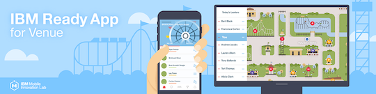

# Ready App for Venue

## Overview

IBM Ready App for Venue demonstrates a personalized and social experience within the fictional theme park - Brickland. At Brickland, visitors use their mobile app to discover what is near them, find their way to their favorite attractions, keep in touch with their group, and achieve badges based on their activity.

## Getting Started

Please visit the [Getting Started page](http://lexdcy040194.ecloud.edst.ibm.com/venue_1_0_0/getting_started) to set up the project.

## Documentation

Please visit [this page](http://lexdcy040194.ecloud.edst.ibm.com/venue_1_0_0/home) for access to the full documentation.

## Project Structure

* `/iOS`        directory for the iOS client.
* `/companion-iPad` directory for the companion application.
* `/nodejs`     directory for the nodeJS server that receives calls from MFP.
* `/venue-mfpf` directory for the MFP server. This server is a gate keeper that passes iOS request to NodeJS through the following process:
  1. Receives request from iOS and might perfom some authorization logic through the MFP framework.
  2. Sends an internal request to the NodeJS server.
  3. Receives the response from NodeJS might apply some transformation and then sends it a response to iOS.
* `/scripts`    directory for useful scripts for the project like building and running the server components in development computer.

## License

IBM Ready App for Venue is available under the IBM Ready Apps License Agreement. See the [License file](https://github.com/IBM-MIL/IBM-Ready-App-for-Venue/blob/master/License.txt) for more details.
